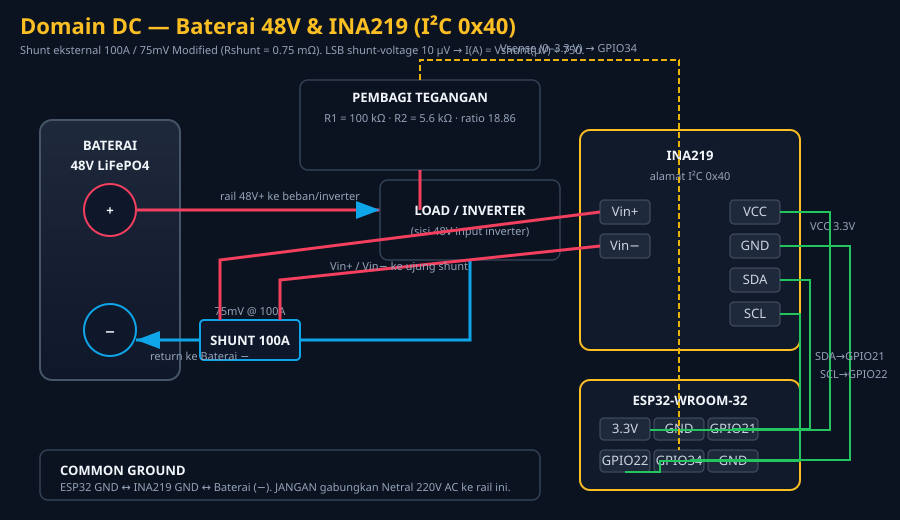
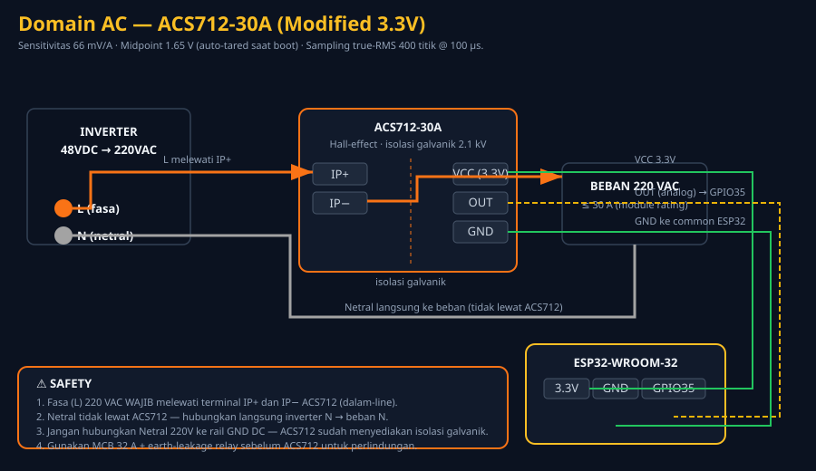
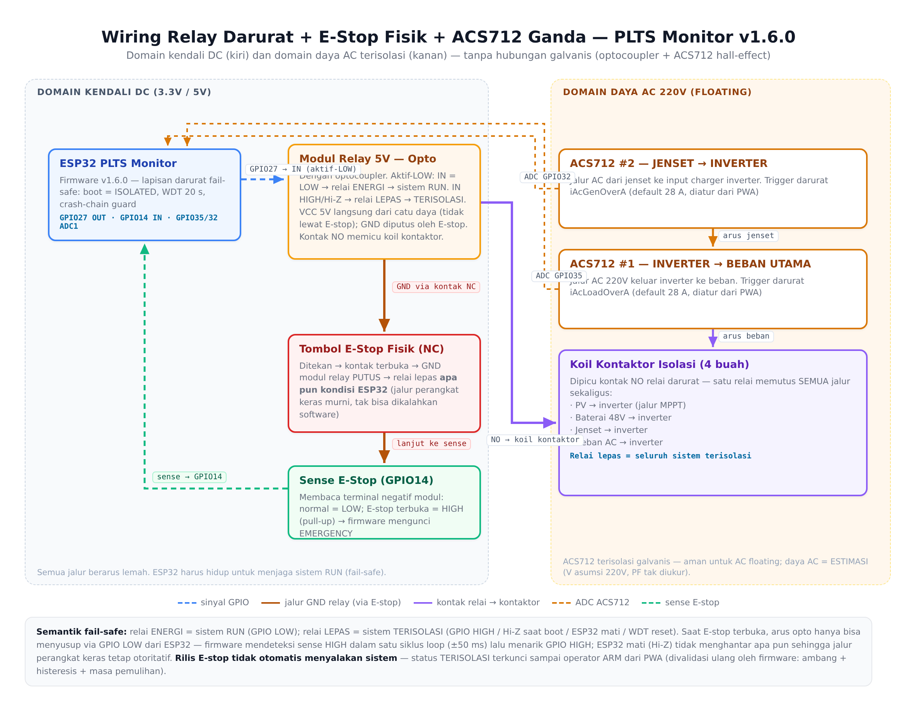

# PLTS Monitor & MonitorIoT Push-Alarm — Firmware, Backend GAS, Toolkit

**Firmware produksi:** v1.6.3 · **Firmware generic:** v1.6.0 · **Firmware alarm:** v1.1.0 · **Backend GAS:** WAVE-7 · **License:** MIT
**Status:** LIVE (dua repositori GitHub + dua proyek Vercel aktif, seluruh rantai platform gratis Rp0 — tanpa kartu kredit)
**Repositori kembar (frontend/dasbor):** [desvandi/plts_monitor_PWA_only](https://github.com/desvandi/plts_monitor_PWA_only)

Repositori ini adalah pusat backend & perangkat untuk sistem monitoring PLTS
(pembangkit listrik tenaga surya, baterai 48 V LiFePO4). Ia memuat **dua
subsistem yang saling melengkapi**, keduanya sudah terverifikasi
production-grade lewat rangkaian audit berlapis:

| Subsistem | Fungsi | Komponen utama di repo ini |
| :--- | :--- | :--- |
| **A — PLTS Monitor** (dasbor) | Telemetri lengkap (tegangan/arus/daya baterai, AC, lingkungan, BMS) → Google Apps Script → PWA Next.js; realtime MQTT opsional | `code.gs/`, `firmware/`, `firmware-generic/`, `scripts/` |
| **B — Push-Alarm MonitorIoT** | Alarm sensor via Web Push terenkripsi (VAPID + aes128gcm) ke HP walau aplikasi tertutup | `push-alarm/` (gas, firmware, tools, tests) |

Kedua subsistem memakai pola yang sama: **ESP32 → HTTPS → Google Apps Script**,
tanpa server berbayar, tanpa broker wajib. MQTT hanya opsional di Topologi B.
Skala yang didesain: **2 HP penerima + 1 modul monitoring** — jauh di bawah
batas kuota semua platform gratis yang dipakai (rincian kuota vs beban ada di
Lampiran A panduan deploy).

> **Dokumen operasional utama:** [`Panduan_Deploy_Production_MonitorIoT.pdf`](Panduan_Deploy_Production_MonitorIoT.pdf)
> (di **akar** repositori ini, Edisi 3, 38 halaman) — kamus klik-demi-klik
> semua parameter/env/kredensial, prosedur deploy GAS → PWA → firmware,
> skenario acceptance, dan peta platform gratis Rp0. Salinan PDF yang sama
> juga ada di akar repo kembar.

---

## Daftar Isi

1. [Gambaran Sistem](#1-gambaran-sistem)
2. [Struktur Repositori & Dokumentasi](#2-struktur-repositori--dokumentasi)
3. [Arsitektur & Topologi Deployment](#3-arsitektur--topologi-deployment)
4. [Deployment End-to-End (Subsistem A)](#4-deployment-end-to-end-subsistem-a)
5. [Panduan Deploy Push-Alarm (Subsistem B)](#5-panduan-deploy-push-alarm-subsistem-b)
6. [Backend GAS PLTS — Kontrak API](#6-backend-gas-plts--kontrak-api)
7. [Subsistem Push-Alarm — Komponen](#7-subsistem-push-alarm--komponen)
8. [Hardware: BOM, Wiring, Kalibrasi](#8-hardware-bom-wiring-kalibrasi)
9. [Port BMS/Inverter Multi-Protokol](#9-port-bmsinverter-multi-protokol)
10. [Skema Data, Config & State Machine](#10-skema-data-config--state-machine)
11. [Build, CI & Pengujian](#11-build-ci--pengujian)
12. [Troubleshooting](#12-troubleshooting)
13. [Keterbatasan yang Diketahui](#13-keterbatasan-yang-diketahui)
14. [Contributing & License](#14-contributing--license)

---

## 1. Gambaran Sistem

### 1.1 Prinsip desain inti

Prinsip yang dijaga di seluruh tumpukan: ***sistem tidak boleh berbohong pada
operator*** — tanpa silent fallback, tanpa data sintetis, tanpa backfill
energi. Setiap angka membawa jejak asal (`source`/`quality`/`provenance`);
sensor gagal dilaporkan `null` (bukan `0`); telemetri basi ditandai `STALE`
(bukan dipretends real-time). Seluruh firmware bersifat **monitoring-only** —
tidak menggerakkan relay/aktuator apa pun, sesuai brief keamanan proyek.

### 1.2 Platform gratis Rp0 (semua lapisan)

| Lapisan | Platform | Batas gratis vs beban aktual |
| :--- | :--- | :--- |
| Hosting web | **Vercel Hobby** (2 proyek) | Tanpa kartu kredit; kuota Hobby jauh melampaui 2 HP + 1 modul |
| Backend + database | **Google Apps Script + Sheet** | Kuota UrlFetchApp harian >> kebutuhan 1 modul (interval detik-menit) |
| Push notification | Push service peramban (FCM/APNs/Mozilla) | Gratis, tanpa akun, tanpa Firebase |
| Kode sumber | **GitHub** (2 repo) | Unlimited untuk repo publik |
| Waktu | NTP publik | Gratis |
| CA TLS | `pki.goog` (GTS Root R1+R4 tertanam di firmware) | Gratis |

MQTT **tidak dibutuhkan** untuk topologi yang dipakai sekarang (firmware POST
HTTPS langsung ke GAS). Bila suatu saat dibutuhkan realtime < 5 detik, opsi
broker gratis (EMQX/HiveMQ free tier) dibahas di Lampiran A panduan. Tidak
ada satu pun komponen berbayar di jalur yang dipakai; mustahil muncul tagihan
mendadak karena tidak ada kartu kredit terpasang.

### 1.3 Status mutu (ringkas)

- **Suite regresi subsistem B:** 203 asersi (35 kripto + 17 PWA + 151 audit
  silang) hijau stabil; kripto + audit silang diuji berulang (protokol
  deteksi bug probabilistik X-8).
- **Suite subsistem A:** ~200 asersi Python (logika firmware) + kontrak GAS
  (mock SpreadsheetApp) + vitest PWA — tsc/eslint 0 error.
- **Verifikasi TLS firmware alarm:** CA GTS Root R1+R4 byte-identik dengan
  `pki.goog` (4/4).
- Audit berlapis (desain → audit final → audit silang; gelombang remediasi
  2026-08) — verdict **PRODUCTION GRADE**. Arsip laporan audit historis
  tersedia di **riwayat git** (folder `docs/remediation-2026-08/` di commit
  sebelum restukturisasi 2026-09-01); temuan-temuan pentingnya sudah
  terserap ke kode, README ini, dan panduan PDF.

---

## 2. Struktur Repositori & Dokumentasi

```
plts_monitor_firmware-code.gs-etc/
├── README.md                                  ← dokumen ini (satu-satunya README)
├── Panduan_Deploy_Production_MonitorIoT.pdf   ← panduan go-live END-TO-END (akar)
├── code.gs/                 Backend GAS subsistem A (Master Sheet PLTS)
│   └── Code.gs
├── firmware/                Firmware produksi PLTS (modular, 108 berkas)
│   ├── Core/ Comm/ Drivers/ Services/ Web/ Storage/ Network/ AI/ Utils/
│   ├── firmware_v1.ino · platformio.ini · partitions_ota_1mb5.csv
│   └── scripts/assert_production_secrets.py
├── firmware-generic/        Firmware zero-touch (captive portal, /install)
│   ├── src/plts_firmware_v1.ino · platformio.ini
│   ├── bin/ (bootloader, partitions, plts_firmware_v1.6.0.bin)
│   └── manifest.json
├── push-alarm/              Subsistem B lengkap
│   ├── gas/Code.gs + gas/WebPushCore.gs      (backend Web Push)
│   ├── firmware/MonitorIoT_Firmware/          (sketch ESP32 alarm)
│   │   └── tools/ (roots.pem + generator/verifikator CA)
│   ├── tools/ (6 alat deployment)
│   ├── tests/ (3 suite regresi + run-all.sh)
│   ├── package.json (dev-dep Playwright untuk smoke test)
│   └── repos.conf.example (template remote utk push-all-repos.sh)
├── scripts/                 Suite uji Python + kontrak GAS + rilis/signing
├── docs/
│   ├── Desain_Push_API_VAPID_Alarm_PWA.pdf    (desain subsystem push-alarm)
│   └── wiring/ (dc-domain.svg, ac-domain.svg)
└── .github/workflows/build-firmware.yml       (CI — uji Python + build PIO)
```

**Aturan dokumentasi (struktur ramping):**

- **Satu README** per repositori — sub-README lama (`code.gs/`,
  `firmware-generic/`, `push-alarm/`) sudah digabung ke dokumen ini.
- **Panduan deploy selalu di akar** (`Panduan_Deploy_Production_MonitorIoT.pdf`),
  bukan terkubur di subfolder — salinan identik ada di akar repo kembar.
- Dokumen desain push-alarm ada di `docs/` bersama diagram wiring.
- Arsip historis (21 dokumen remediation + 2 PDF audit) dihapus dari HEAD
  demi struktur ramping — bisa diambil kembali dari riwayat git.

---

## 3. Arsitektur & Topologi Deployment

### 3.1 Topologi A — Zero-Touch (mulai di sini)

Untuk instalasi pertama / uji bench / pilot. Tanpa broker MQTT, tanpa build
C++ lokal. Total waktu ±30 menit.

```
+------------------------------------------------------------------+
|  [1] Google Sheet + Apps Script  (backend data, gratis)           |
|            ^                    ^                                  |
|            | HTTPS JSON          | HTTPS JSON (poll)               |
|            | TELEMETRY flat      | LATEST / OTA_MANIFEST           |
|            | (legacy token)      |                                  |
|  [3] ESP32 + firmware-generic    [2] PWA (Vercel) — /setup wizard  |
|      flash via browser /install        dashboard + fleet           |
+------------------------------------------------------------------+
```

### 3.2 Topologi B — Production-Grade (fitur penuh)

Untuk operasi berkelanjutan: realtime MQTT, alarm BMS, provenance SOC,
auth per-device, OTA Ed25519.

```
  [3] ESP32 + firmware/ (production build)
        |  MQTT/TLS 8883 (realtime, telemetry kanonik)
        v
  [4] Broker MQTT self-host          [1] GAS (history, laporan, AI insights)
        |  wss: 8884                       ^  HTTPS (backup 1 jam + proxy)
        v                                  |
  [2] PWA (Vercel/self-host) ——— subscribe MQTT + REST ke ESP32 (LAN/tunnel)
```

> Mulai dari **Topologi A** untuk membuktikan rantai data utuh (PONG → baris
> Telemetry → dashboard). Naik ke **Topologi B** ketika butuh realtime < 5 s,
> alarm BMS, atau multi-device terkelola. Keduanya bisa berjalan bergandengan:
> firmware generic mengirim flat schema, firmware produksi mengirim envelope
> kanonik — GAS menerima keduanya (lihat §6).

### 3.3 Rantai push-alarm (subsistem B)

```
[3] ESP32 (push-alarm/firmware) --HTTPS POST (token)--> [1] GAS PushService
   3 sensor · ambang lokal · backoff                    Code.gs + WebPushCore.gs
                                                              | Web Push VAPID
                                                              | payload aes128gcm
                                                    +---------+---------+
                                                    v                   v
                                        [2a] PWA standalone    [2b] Aplikasi Next.js
                                            (repo kembar,         (repo kembar,
                                             pwa-push-alarm/)      push-alarm natif)
```

Kedua penerima memakai kontrak push identik (Tabel 11 audit silang: K1
langganan, K2 penghapusan, K3 payload alarm, K4 ACK, K5 deep-link, K6 ambang,
K7 kunci VAPID, K8 hardening). **Aturan anti-duplikat: 1 perangkat cukup
berlangganan dari SATU aplikasi** — backend-nya sama, subscribe ganda =
notifikasi dobel. Panduan lengkap pemakaian dua proyek Vercel: Bab 2.3
panduan PDF.

---

## 4. Deployment End-to-End (Subsistem A)

Panduan ini merangkai komponen subsistem A secara berurutan. **Jangan lompat
langkah** — setiap langkah punya gerbang verifikasi. Versi klik-demi-klik
termasuk semua nilai env/kredensial: Bab 3–5 panduan PDF.

### 4.0 Prasyarat

| Kebutuhan | Keterangan |
| :--- | :--- |
| Akun Google | untuk Sheet + Apps Script (gratis) |
| GitHub / Vercel (atau host statis+Node) | untuk PWA |
| ESP32-WROOM-32 (4 MB flash) + kabel USB **data** | board DevKit v1 umum |
| Browser Chrome/Edge/Opera **desktop** | Web Serial API untuk flashing browser |
| WiFi 2,4 GHz | ESP32 tidak mendukung 5 GHz |
| Multimeter + clamp meter | verifikasi kalibrasi (opsional, disarankan) |
| Python 3.10+ / PlatformIO | hanya untuk Jalur B atau pengembangan |

### 4.1 Langkah 1 — Backend: Google Sheet + Apps Script

1. Buat Google Sheet baru (atau *Make a copy* dari Master Sheet Template).
2. **Extensions → Apps Script** → hapus isi `Code.gs` bawaan → paste seluruh
   isi [`code.gs/Code.gs`](code.gs/Code.gs) → **Save**.
3. Jalankan fungsi `setupMasterTemplate()` **sekali** dari editor GAS
   (dropdown fungsi → Run → izinkan akses). Tab `Config`, `Telemetry`,
   `Ota`, `OtaEvents`, `Calibration`, `Devices` dibuat otomatis.
4. Buka tab **Config**, ganti `AUTH_TOKEN` (mis. `plts_sec_namaanda2026x`)
   — jangan pakai default `CHANGE_ME`. Catat `DEVICE_KEY`
   (mis. `PLTS_MONITOR_01`).
5. **Deploy → New deployment → Web app**:
   - *Execute as:* **Me**
   - *Who has access:* **Anyone** (wajib — ESP32 dan PWA memanggil dari
     jaringan berbeda; keamanan dijaga AUTH_TOKEN, bukan akun Google)
6. Salin **Web App URL** (`https://script.google.com/macros/s/…/exec`).

> **Menambah perangkat ke fleet? Daftarkan di tab `Devices`.** Backend
> berjalan *fail-closed*: begitu tab `Devices` berisi ≥1 perangkat, SETIAP
> aksi ber-scope perangkat wajib menunjuk `device_key` terdaftar — key tak
> dikenal ditolak `400 Unknown device_key`. Format baris:
> `device_key | secret | label | (2 kolom sistem)`. Perangkat token-legacy
> isi `secret` bebas; firmware produksi HMAC isi secret 64-hex per perangkat.

**Gerbang verifikasi** — dari terminal:

```bash
curl -s -X POST "<WEB_APP_URL>" \
  -H "Content-Type: application/json" \
  -d '{"action":"PING","token":"<AUTH_TOKEN_ANDA>"}'
# HARUS mengandung "status":"SUCCESS" dan "PONG". Bila 401 → token salah;
# bila halaman HTML login → deployment bukan "Anyone".
```

### 4.2 Langkah 2 — Frontend: Deploy PWA

PWA adalah aplikasi **Next.js** — deploy dari repositori kembar
[`plts_monitor_PWA_only`](https://github.com/desvandi/plts_monitor_PWA_only)
(Vercel: import repo → framework terdeteksi otomatis → Deploy; tanpa env var
untuk mode zero-touch). Buka domain PWA → redirect ke `/setup` → isi **GAS
Web App URL** + **Auth Token** + **Device Key** (sama dengan Langkah 1) →
**Test Handshake**. Panduan lengkap + opsi self-host: README repo kembar §2.

### 4.3 Langkah 3 — Perangkat: Flash ESP32

#### Jalur A — firmware-generic, zero-tooling (disarankan untuk mulai)

1. Buka `https://<domain-pwa>/install` di Chrome/Edge **desktop**. Label versi
   dibaca langsung dari manifest — apa yang tertulis = apa yang di-flash.
2. Colok ESP32 via kabel USB **data** (bukan charge-only).
3. Klik **Install PLTS Firmware** → pilih port (`CP210x`/`CH340`) → tunggu
   100% + reboot (±60–90 detik).
4. ESP32 memancarkan SSID `PLTS-Monitor-Setup-XXXX` → sambungkan → captive
   portal di `192.168.4.1` (buka manual bila tidak muncul).
5. Isi form portal: WiFi SSID+password (2,4 GHz), GAS Web App URL + Auth
   Token, Device Key, interval telemetri, faktor kalibrasi (default dulu).
6. Save → reboot → connect WiFi → telemetri mulai mengirim.

> Alternatif tanpa browser (QA/developer): `cd firmware-generic && pio run
> -e esp32dev` lalu `pio run -e esp32dev -t upload`. Offset flash:
> bootloader 0x1000, partitions 0x8000, aplikasi 0x10000.
>
> **Aturan sinkron versi (wajib):** `manifest.json → version` HARUS sama
> dengan `FIRMWARE_VERSION` di `src/plts_firmware_v1.ino`, dan nama file di
> `bin/` harus `plts_firmware_v<versisama>.bin`. Mismatch = tombol install
> PWA gagal diam-diam.

#### Jalur B — firmware production-grade (fitur penuh)

MQTT/TLS realtime, REST + auth per-device (JWT/HMAC), multi-protokol
BMS/inverter, provenance SOC, alarm lanjutan, OTA Ed25519, spool offline.

```bash
git clone https://github.com/desvandi/plts_monitor_firmware-code.gs-etc.git
cd plts_monitor_firmware-code.gs-etc/firmware
pio run -e development    # atau staging
pio run -e development -t upload
```

- **development**: bebas secrets, broker publik uji.
- **staging**: guard produksi aktif, kredensial contoh.
- **production**: **fail-closed** — build menolak jalan tanpa MQTT TLS,
  kunci Ed25519, dan CORS bukan `*` (lihat §4.5).

**Provisioning WiFi (perangkat baru)** — firmware produksi punya portal AP:
boot pertama memancarkan SSID `PLTS-Monitor-Setup-XXXX` (WPA2, password
CSPRNG 32 karakter diungkap SEKALI di Serial Monitor — blok
`[ConfigStore] Password AP BARU (CATAT & SIMPAN!)`). Sambungkan → portal
`http://192.168.4.1` → isi SSID+password WiFi → **Simpan & Restart**.
Endpoint `POST /api/provision` hanya aktif di mode AP; perangkat yang sudah
online menolak 403. Konfigurasi lanjutan (kapasitas baterai, BMS/inverter,
kalibrasi, OTA) lewat REST `/api/config` setelah login operator (username
`admin`, password acak pertama-boot diungkap sekali di Serial — segera ganti)
atau PWA mode direct-REST. QR onboarding PWA (`Settings → QR Onboarding`)
juga dipahami (fragment `#plts=<base64>` mengisi form otomatis).

> Catatan kejujuran: `GAS_INGEST_URL`/`GAS_INSIGHTS_URL` dan kredensial
> broker MQTT produksi di-set via build flags — bukan lewat portal.
> GasAdvisor fail-closed bila kosong (tidak pernah mengarang URL).

### 4.4 Langkah 4 — Komisioning & Verifikasi

Jangan percaya sistem sebelum semua baris hijau (±5 menit):

| # | Verifikasi | Cara | Hasil yang benar |
| :--- | :--- | :--- | :--- |
| V1 | Handshake GAS | PWA `/setup` → Test Handshake | `PONG`, tersimpan |
| V2 | Telemetri masuk | Tab `Telemetry` di Sheet | Baris baru tiap interval; `fw_version` terisi |
| V3 | Angka masuk akal | `v_bat` vs multimeter | Selisih < ±0,5 V (pra-kalibrasi) |
| V4 | Dashboard hidup | PWA `/` | Kartu update + badge kualitas `VALID/MEASURED` |
| V5 | Kejujuran sensor | Cabut INA219 saat berjalan | `null`/`SENSOR_ERROR` — **bukan** 0 |
| V6 | Alarm lifecycle | Turunkan `LOW_BATTERY_CUTOFF_V` | Alarm muncul, bisa ACK, lalu clear |
| V7 | OTA siap | PWA → Settings → OTA → Check | Versi terbaca, status jelas |
| V8 | (Jalur B) BMS | PWA → Settings → BMS → `auto` | Panel BMS muncul; badge SOC `BMS Direct` |

### 4.5 Hardening Produksi (Topologi B)

Naikkan ke production build hanya setelah komisioning lulus:

1. **Broker MQTT self-host dengan TLS** (port 8883) — broker publik
   DITOLAK firmware.
2. **Pasangan kunci Ed25519 untuk OTA**:
   ```bash
   pip install cryptography
   python3 scripts/sign_firmware.py --gen-keys   # private + public PEM
   ```
   Public key (64 hex) masuk build flag; private key disimpan aman.
3. **Build production** (semua wajib — guard menolak bila kurang):
   ```bash
   pio run -e production -- \
     -DMQTT_BROKER_HOST=\"broker.domainanda.com\" \
     -DMQTT_BROKER_PORT=8883 \
     -DMQTT_USERNAME=\"plts-device-001\" \
     -DMQTT_PASSWORD=\"password-kuat-32-karakter\" \
     -DMQTT_ROOT_CA=\"-----BEGIN CERTIFICATE-----\n…\n-----END CERTIFICATE-----\" \
     -DOTA_ED25519_PUBLIC_KEY_HEX=\"<64-hex>\" \
     -DOTA_HTTPS_ROOT_CA=\"-----BEGIN CERTIFICATE-----\n…\n-----END CERTIFICATE-----\" \
     -DALLOWED_CORS_ORIGINS=\"https://plts.domainanda.com\"
   ```
4. **Auth per-device (HMAC-SHA256)** — daftarkan device + secret 64-hex di
   sheet `Devices` (kontrak lengkap §6.3); pengganti token tunggal.
5. **Akses LAN**: ekspos REST ESP32 via Cloudflare Tunnel (HTTPS) — jangan
   port-forward polos.

### 4.6 Siklus Update OTA & Rilis firmware-generic

**firmware-generic (HMAC + SHA-256):** upload `.bin` dari PWA → PWA hitung
`hmac = HMAC_SHA256(AUTH_TOKEN, version|url|sha256)` → publish manifest ke
GAS (`OTA_PUBLISH`, wajib `admin_token`) → ESP32 poll tiap 1 jam → verifikasi
HMAC + SHA-256 penuh pasca-download → flash → reboot. **Rollback otomatis**:
boot baru gagal WiFi/health 3× berturut → kembali ke partisi lama + lapor
`OTA_STATUS=ROLLBACK` (tercatat di `OtaEvents`); sukses 60 s → `ACTIVATED`.

**firmware produksi (Ed25519):** tanda tangan Ed25519 atas SHA-256 binari
(`scripts/sign_firmware.py --sign firmware.bin`), URL download wajib HTTPS
dari allowlist.

**Rilis versi generic baru:** CI mem-build binari hanya di repo ini; sinkron
ke PWA lewat skrip resmi:

```bash
# 1. Edit src/plts_firmware_v1.ino, bump FIRMWARE_VERSION
# 2. Edit manifest.json → samakan "version" (guard menolak bila beda)
python3 scripts/release_firmware_generic.py --pwa-path ../plts_monitor_PWA_only
# 3. Commit kedua repo sesuai perintah yang dicetak skrip
```

Skrip ini: build → guard kejujuran versi → salin 3 binari ke `bin/` → hapus
binari lama → sinkron ke PWA `public/firmware/` → cetak perintah commit.
Gagal di tengah = abort, tidak pernah menulis setengah rilis.

---

## 5. Panduan Deploy Push-Alarm (Subsistem B)

Versi klik-demi-klik lengkap (kunci VAPID, Script Properties, hosting,
acceptance S1–S5, troubleshooting 15 baris) ada di
[`Panduan_Deploy_Production_MonitorIoT.pdf`](Panduan_Deploy_Production_MonitorIoT.pdf).
Ringkasan alurnya:

1. `node tools/generate-vapid-keys.js --save` — pasangan kunci VAPID P-256
   (privat 32 byte, publik 65 byte `0x04`). Simpan `vapid-keys.json` di
   folder rahasia.
2. `node tools/prep-deploy-secrets.js` — token perangkat 32-byte base64url
   + `script-properties.txt` siap salin-tempel ke GAS.
3. **Deploy GAS PushService** — tempel `push-alarm/gas/Code.gs` +
   `push-alarm/gas/WebPushCore.gs` + 3 Script Properties → Deploy Web App →
   salin URL `/exec`.
4. `node tools/apply-deploy-config.js --pwa-dir <clone-PWA>/pwa-push-alarm
   --fw-dir push-alarm/firmware/MonitorIoT_Firmware --url "URL/exec" --out
   build` — injektor atomik menanam URL + kunci publik ke PWA, URL + token
   (+opsional WiFi) ke firmware.
5. `node tools/verify-deployment.js --config build/pwa-push-alarm/js/config.js
   --sw build/pwa-push-alarm/sw.js` — harus **SIAP DEPLOY** (termasuk bukti
   pasangan kunci privat→publik).
6. Hosting build PWA (Vercel/GitHub Pages/Netlify) + flash firmware alarm.
   Aktivasi: buka PWA → aktifkan notifikasi → uji `simulateAlarmPush()` dari
   editor GAS — notifikasi harus masuk **walau PWA tertutup**.

### 5.1 Manajemen rahasia & gerbang pre-push

- Kunci privat VAPID dan token perangkat TIDAK PERNAH di-commit, tidak
  ditanam di PWA, tidak dikirim ke firmware lewat jalur lain.
- `push-alarm/tools/prepush-audit.js` memindai nilai eksaklit + pola (token
  base64url 43-karakter berbatas, blok PRIVATE KEY PEM, URL deployment GAS
  nyata) pada semua berkas terlacak — **push diblokir bila ada temuan**.
- Bila rahasia terlanjur bocor: rotasi (kunci baru + token baru + update
  Script Properties + injeksi ulang PWA/firmware) — prosedur lengkap
  Bab 6 panduan PDF.
- Penerima push: **pilih salah satu** antara aplikasi Next.js utama
  (Settings → Server Push Alarm) atau PWA standalone — jangan keduanya di
  HP yang sama (notifikasi dobel, backend sama).

---

## 6. Backend GAS PLTS — Kontrak API

File tunggal [`code.gs/Code.gs`](code.gs/Code.gs) di-deploy sebagai Web App
pada Master Sheet. Semua endpoint menerima **POST JSON** dan menjawab dengan
envelope seragam:

```json
{ "status": "SUCCESS" | "ERROR",
  "code":   200 | 400 | 401 | 500,
  "data":   { ... },
  "message":"...",
  "timestamp":"2026-02-22T…Z" }
```

| Action | Deskripsi |
| :--- | :--- |
| `PING` | Handshake — balas `PONG` |
| `TELEMETRY` | Ingest 1 envelope (nested kanonik ATAU flat legacy) — responsnya kini membawa `pendingEmergency` |
| `LATEST` / `HISTORY` / `DAILY` / `SEQ_STATUS` | Model baca kanonik (v1.7: blok `emergency` + `ac.gensetRmsCurrent`) |
| `OTA_PUBLISH` / `OTA_MANIFEST` / `OTA_STATUS` | Siklus OTA |
| `CALIBRATION_PUBLISH` / `CALIBRATION_PENDING` / `CALIBRATION_ACK` | Antrean kalibrasi |
| `EMERGENCY_COMMAND` / `EMERGENCY_PENDING` / `EMERGENCY_ACK` / `EMERGENCY_EVENT` / `EMERGENCY_LOG` | **[WAVE-7] Lapisan kendali darurat** (lihat §6.5) |
| `HEALTH` | Probe publik untuk uptime monitor |

### 6.1 Perubahan v1.6.0 — Provenance SOC + blok BMS

1. **Kolom baru tab `Telemetry`** (di-append tanpa menggeser indeks lama):
   `soc_source`, `bms_protocol`, `bms_connected`, `bms_cell_v_min`,
   `bms_cell_v_max`, `bms_temp_c`, `bms_fault_flags`.
2. **Migrasi header otomatis** — deployment lama (24 kolom) diperluas ke 31
   kolom saat penulisan pertama; baris lama tetap valid.
3. **Envelope keluar** membawa `battery.soc.provenance`
   (`BMS_DIRECT|SHUNT_COULOMB|OCV_ESTIMATED|UNKNOWN`) dan blok
   `battery.bms` rekonstruksi untuk baris v1.6.
4. **Kejujuran data lama**: baris pra-1.6 terbaca `provenance=UNKNOWN` — GAS
   tidak pernah menduga asal SOC yang tidak dicatat.

### 6.2 Autentikasi (dua jalur per-device)

1. **LEGACY token** — `{ token }` vs `Config!AUTH_TOKEN` (kompatibilitas
   firmware-generic). Pembandingan tahan-timing. Domain kepercayaan = satu
   token untuk seluruh deployment.
2. **HMAC-SHA256** (produksi, kontrak v2.1) — kredensial DI DALAM body:
   `{action, auth:{method, timestamp, nonce, deviceId, signature},
   data:"<string JSON mentah>"}` dengan secret per-device dari sheet
   `Devices`; `action` ikut ditandatangani; jendela replay ±300 s + cache
   nonce 10 menit. (GAS Web App tidak bisa membaca header HTTP — skema
   X-Auth-* lama mustahil dan sudah dihapus.)

### 6.3 Otorisasi lintas device (fail-closed)

- **Pengikatan identitas HMAC** — `deviceId` ter-tanda-tangan ADALAH
  identitas pemanggil; `body.device_key` menunjuk perangkat lain → `400`.
- **CALIBRATION_ACK terikat pemilik** — hanya device yang dituju yang boleh
  ACK; ACK lintas device → `400`, baris tetap `applied=false`.
- **Gerbang admin OTA** — `OTA_PUBLISH` wajib `admin_token` =
  `Config!ADMIN_TOKEN`; kosong/belum diset = publish DINONAKTIFKAN.
- **Rentang kalibrasi** — `v_calib∈[0.1,100]`, `i_calib_dc/ac∈[0.1,50]`;
  di luar rentang → `400` tanpa baris ditulis.
- **Presisi LATEST** — tie-break `event_time+sequence` dua perbandingan
  eksplisit (bukan `ev*1e6+seq` yang kehilangan presisi di atas 2^53).
- **Gerbang perangkat-terdaftar** — begitu sheet `Devices` berisi ≥1
  perangkat, SEMUA aksi ber-scope perangkat menolak `device_key` tak
  terdaftar (`400 Unknown device_key`); selama kosong, gerbang terbuka.

### 6.4 Pengujian GAS (tanpa deployment riil)

```bash
node scripts/test_gas_contract.js        # 75 asersi (kontrak + round-trip v1.6/v1.7 + gerbang fail-closed)
node scripts/test_wave1_integration.js   # 44 — pipeline ingest dua jalur
node scripts/test_wave2_data_honesty.js  # 38 — kejujuran data
node scripts/test_wave3_authorization.js # 45 — otorisasi lintas device
node scripts/test_emergency_gas.js       # 46 — kontrak lapisan darurat WAVE-7
```

Menggunakan mock SpreadsheetApp/LockService/CacheService. Smoke test
produksi: `scripts/wave1_smoke_test.sh` (7 seksi; mendeteksi deployment yang
belum memuat patch terbaru).

### 6.5 Lapisan Kendali Darurat (WAVE-7, v1.7)

Relay darurat aktif-LOW (opto) + E-stop fisik + 5 pemicu sensor
(ambang diatur operator dari PWA). Semantik **fail-safe**: relay ENERGI =
sistem RUN (GPIO LOW); relay LEPAS = sistem TERISOLASI (boot / hang /
crash-loop / trip / E-stop / brownout). Satu relay memutus keempat
kontaktor isolasi (PV, baterai, jenset, beban AC) sekaligus.

**Alur perintah (operator → perangkat):**

```
PWA --EMERGENCY_COMMAND(admin_token)--> EmergencyQueue (PENDING)
perangkat <--pendingEmergency (piggyback TELEMETRY / poll 15 dtk)--
perangkat memvalidasi ulang + eksekusi --EMERGENCY_ACK--> baris APPLIED
```

| Aspek | Kontrak |
| :--- | :--- |
| Otorisasi | `EMERGENCY_COMMAND` wajib `admin_token` (= `Config!ADMIN_TOKEN`); **fail-closed** saat kosong — kredensial perangkat TIDAK cukup menghentikan/menyalakan sistem |
| Konsumsi | Piggyback pada respons `TELEMETRY` (nol polling tambahan saat jalur normal) + `EMERGENCY_PENDING` khusus (15 dtk) saat backoff |
| Umur perintah | TTL `EMERGENCY_QUEUE_TTL_MIN` (default 10 menit) — perintah basi EXPIRED, tidak pernah diterapkan diam-diam |
| ACK | Terikat `device_key` (ACK lintas perangkat → 400), idempoten (re-ACK → 200 settled) |
| Validasi CONFIG | Skema 12 field divalidasi **3 lapis** (PWA clamp → GAS range-check → firmware range-check); field tak dikenal dibuang |
| Event | `EMERGENCY_EVENT` (TRIP/ESTOP/BOOT/CRASHLOOP/ARMED/DISARMED/…) → sheet `EmergencyEvents` (rotasi 500 baris) + Telegram opsional + cooldown per topik |
| Gate ARM perangkat | Firmware MENOLAK ARM bila pemicu masih aktif (histeresis), masa pulih belum lewat, atau crash-chain ≥ 3 — alasan penolakan dikirim balik ke operator |
| Kolom telemetri v1.7 | `i_ac_gen`, `emg_state`, `emg_reason`, `emg_estop`, `emg_trips` (di-append; baris lama → `UNKNOWN`, tidak difabrikasi) |

Pin default firmware-generic v1.6.0: relay **GPIO 27**, sense E-stop
**GPIO 14** (INPUT_PULLUP, opsional), ACS712 #2 jenset **GPIO 32**
(ADC1_CH4). Semua bisa dipindahkan lewat perintah CONFIG tanpa reflash.
Wiring: lihat [`docs/wiring/emergency-relay.png`](docs/wiring/emergency-relay.png)
(§8.2).

---

## 7. Subsistem Push-Alarm — Komponen

Folder [`push-alarm/`](push-alarm/) berisi subsistem alarm lengkap; komponen
PWA-nya ada di repo kembar (folder `pwa-push-alarm/`). Seluruh subsistem
terverifikasi lewat 3 tahap audit (desain → final → silang) dengan suite
regresi yang **menjalankan kode asli** ketiga komponen.

> `push-alarm/gas/Code.gs` identik secara fungsional dengan `PushService.gs`
> pada rilis paket — hanya nama file menyesuaikan konvensi Apps Script.
> Kesetaraannya dibuktikan suite regresi yang mengeksekusi isi file.

### 7.1 `gas/` — backend Web Push

| Berkas | Isi |
| :--- | :--- |
| `gas/Code.gs` | Modul utama: doGet/doPost, ingest firmware, langganan push, kirim alarm, ACK, snapshot, rate-limit (testPush 60 dtk) |
| `gas/WebPushCore.gs` | Kripto Web Push murni-JS untuk GAS: ECDH P-256, ECDSA, HKDF, AES-128-GCM, JWT VAPID, enkripsi payload RFC 8291 |

### 7.2 `firmware/MonitorIoT_Firmware/` — pelapor sensor ESP32

Sketch single-file: 3 sensor (DHT22/simulasi), evaluasi ambang **lokal**
(mematikan alarm sendiri saat pulih — tidak menunggu server), indikator
non-blocking, backoff eksponensial saat GAS tidak terjangkau, verifikasi TLS
dengan CA GTS Root R1+R4 tertanam (`tools/roots.pem` + generator/verifikator
byte-level). `FW_VERSION` tunggal-sumber.

### 7.3 `tools/` — toolkit 1-perintah

| Alat | Fungsi |
| :--- | :--- |
| `generate-vapid-keys.js` | Generator pasangan kunci VAPID P-256 |
| `prep-deploy-secrets.js` | Token perangkat + Script Properties siap-tempel |
| `apply-deploy-config.js` | Injektor konfigurasi atomik (URL + kunci publik → PWA; URL + token [+WiFi] → firmware); validasi pra-tulis + verifikasi pasca-tulis; menolak URL placeholder/demo |
| `verify-deployment.js` | Gerbang K7: konsistensi config/sw + bukti pasangan kunci privat→publik |
| `prepush-audit.js` | Pemindai rahasia + higienitas git (gerbang WAJIB sebelum push) |
| `push-all-repos.sh` | Push massal terproteksi audit (dry-run tersedia) |

### 7.4 `tests/` — suite regresi 203 asersi

```bash
# clone kedua repo bersebelahan, lalu:
cd plts_monitor_firmware-code.gs-etc/push-alarm
npm i -D playwright && npx playwright install chromium   # sekali saja
bash tests/run-all.sh
```

`run-all.sh` membangun checkout symlink (PWA dari repo kembar + gas/ +
firmware/) lalu menjalankan: `test-webpush-core.js` (35 asersi kripto,
vektor RFC/NIST), `smoke-test-pwa.js` (17 asersi PWA, Chromium headless +
mock GAS), `cross-audit-test.js` (151 asersi kontrak Tabel 11 K1–K8).
Ketiganya harus hijau penuh; suite kripto dan audit silang disarankan
diulang beberapa kali.

### 7.5 Push ke remote

```bash
cp push-alarm/repos.conf.example push-alarm/repos.conf   # isi URL remote
bash push-alarm/tools/push-all-repos.sh                 # audit dulu, baru push
bash push-alarm/tools/push-all-repos.sh --dry-run
```

---

## 8. Hardware: BOM, Wiring, Kalibrasi

### 8.1 BOM & alokasi pin

Firmware monitoring-only; **dua domain arus** dipisah galvanik:

| Modul | Domain | Fungsi | Antarmuka | Pin |
| :--- | :--- | :--- | :--- | :--- |
| ESP32-WROOM-32 | — | MCU utama (4 MB flash) | — | — |
| Pembagi tegangan 100 kΩ / 5,6 kΩ | **DC** | Sensing 48 V (0–60 VDC) | ADC1 | **GPIO 34** |
| **INA219** + shunt 100 A/75 mV | **DC** | Arus DC, resolusi ~10 mA | I²C 0x40 | SDA **21** · SCL **22** |
| **SHT31** | — | Suhu & kelembapan | I²C 0x44 | bus sama |
| **DS3231 RTC** *(ops.)* | — | RTC backup | I²C 0x68 | bus sama |
| **ACS712-30A (3,3 V)** | **AC** | Arus beban 220 VAC, true-RMS | ADC1 | **GPIO 35** |
| **ACS712-30A #2 (3,3 V)** *(v1.6.0 [E-WAVE])* | **AC** | Arus jenset→inverter, true-RMS, auto-tare mandiri | ADC1 | **GPIO 32** |
| **Modul relay 5V opto (aktif-LOW)** *(v1.6.0 [E-WAVE])* | kendali | Relay darurat → 4 kontaktor isolasi | GPIO | **GPIO 27** |
| **Tombol E-stop NC** *(v1.6.0 [E-WAVE])* | kendali | Memutus GND modul relai (jalur HW murni) + sense | GPIO | **GPIO 14** |
| MAX3485 *(ops. v1.6)* | **RS485** | Modbus RTU / konsol BMS | UART2+DE | TX **16** · RX **17** · DE **4** |
| SN65HVD230 *(ops. v1.6)* | **CAN** | CAN 2.0A 500 kbps (Pylontech) | TWAI | TX **25** · RX **26** |
| Buck 48→5 V (isolasi disarankan) | — | Daya ESP32 | — | VIN 5 V |
| LED status / tombol BOOT | — | Indikator / factory reset | GPIO | **2** / **0** (tahan 10 dtk) |

> **Audit 2026-02-22**: firmware ≤1.2.0 keliru mempresentasikan satu channel
> ADC sebagai arus umum. Sejak v1.3.0 arus DC dari **INA219** (I²C), ACS712
> khusus AC. Field lama (`v_pv`, `i_pv`, `p_pv`) deprecated → `v_bat`,
> `i_bat_dc`, `p_bat_dc`, `i_ac_load`.
>
> **Audit noise inverter 2026-09-02 (v1.6.3, firmware produksi modular):**
> empat temuan CRITICAL/HIGH di lingkungan inverter diperbaiki — WDT kini
> di-fed DI DALAM loop unduh OTA (sebelumnya unduh lama = reset watchdog
> tengah flash), stack `otaTask` 4K→6K, bus I²C yang terkunci oleh EMI
> inverter pulih otomatis (`Utils/I2cRecovery`: 9x pulsa SCL + STOP,
> dipanggil driver INA219/SHT31 sebelum keputusan cooldown), dan
> sensitivitas ACS712 diaplikasi di boot (sebelumnya error arus AC
> SISTEMATIS 1.85x setelah reboot: default driver 100 mV/A vs modul
> 185 mV/A). Detail: baris v1.6.3 di §8.5.

### 8.2 Diagram wiring

Dua domain terpisah — DC (baterai + shunt + INA219) dan AC (inverter +
ACS712): [`docs/wiring/`](docs/wiring/).

<p align="center">
  <br/>
  <em>Gambar 1 — Domain DC: baterai 48V, pembagi tegangan, shunt 100A/75mV, INA219 (I²C).</em>
</p>

<p align="center">
  <br/>
  <em>Gambar 2 — Domain AC: inverter 220V, ACS712-30A (Hall-effect), isolasi galvanik.</em>
</p>

<p align="center">
  <br/>
  <em>Gambar 3 — [E-WAVE v1.6.0] Wiring relay darurat + E-stop fisik + ACS712 ganda.
  Domain kendali DC (kiri) dan domain daya AC (kanan) terpisah galvanik.
  Semantik fail-safe: relay lepas = seluruh sistem terisolasi; rilis E-stop
  tidak pernah men-energize ulang — hanya ARM operator (divalidasi firmware).</em>
</p>

**Semantik darurat (harus dipahami operator):**

- ESP32 **harus hidup** untuk menjaga sistem RUN — mati/hang/reset =
  TERISOLASI (fail-safe by design; GPIO Hi-Z saat reset memutus opto).
- **Setiap reboot mengisolasi sistem** — penyalaan kembali hanya lewat ARM
  dari PWA; E-stop fisik tetap berdaulat penuh apa pun kondisi ESP32.
- ARM bisa **DITOLAK firmware** bila pemicu masih aktif / masa pulih belum
  lewat / rantai crash terdeteksi — alasan dikirim balik ke operator.
- Rekomendasi wiring ekstra: kontak E-stop juga diseri di jalur positif
  koil kontaktor (setelah kontak NO relai) agar tidak ada jalur arus
  alternatif melalui ESP32 (analisis sneak-path: §6.5).

Foto instalasi asli dapat ditambahkan ke `docs/wiring/photos/` (≤2 MB per
foto, nama `01-battery-shunt.jpg` dst.) — buat kembali folder itu saat foto
tersedia; foto akan menggantikan diagram SVG bila ditemukan.

### 8.3 Panduan wiring langkah demi langkah

Ditulis untuk **bench pertama**; urutannya *fail-safe* — semua pemeriksaan
multimeter dilakukan SEBELUM daya pertama.

**W.0 Keselamatan (wajib):** lepas sekring baterai sebelum kerja jalur DC
(48 V terisi ratusan ampère pendek); satu tangan di saku saat menyentuh rail
48 V; kabel ber-insulasi penuh + crimping rapi; sisi 220 VAC hanya oleh yang
paham risiko — **netral tidak boleh dipotong** sensor; ikatan statis sebelum
memegang ESP32; jangan menyalakan tanpa pembumian layak pada enclosure logam.

**W.1 Spesifikasi kabel:**

| Jalur | Rekomendasi | Alasan |
| :--- | :--- | :--- |
| Baterai→shunt→inverter (48 V) | 6–10 mm² + lugh/sekring | Drop tegangan & keamanan arus |
| Shunt→INA219 (sense kelvin) | twisted 0,25–0,5 mm², <30 cm | Pembacaan mV bebas noise |
| Pembagi→GPIO 34 | 0,25 mm², sependek mungkin | High-impedance, rawan noise |
| I²C (SDA/SCL) | 0,25 mm², <50 cm total | Bus 400 kHz, kapasitansi ~400 pF |
| RS485 A/B · CAN H/L | twisted-pair ~120 Ω + terminator 2 ujung | Integritas differential |

Terminasi: kabel daya masuk terminal block (bukan Dupont); Dupont hanya
sinyal antar-modul dalam enclosure.

**W.2 Domain DC:** (1) Rakit pembagi tegangan, UJI SENDIRI: 48 V → titik
tengah ≈ **2,55 V** (max 60 V → 3,18 V — aman ADC); titik tengah → GPIO 34,
kaki bawah R2 → common ground. (2) Shunt di jalur RETURN (B−); tidak ada
sambungan lain menempel badan shunt. (3) INA219 `Vin±` **kelvin clamp
langsung di baut ujung shunt** (bukan kabel daya — inilah sumber akurasi
10 mA); modul diset shunt 0,75 mΩ. (4) SHT31/DS3231 paralel di bus I²C sama
(3 alamat berbeda); cukup SATU pasang pull-up 4,7 kΩ untuk seluruh bus.

**W.3 Domain AC:** pastikan ACS712 varian termodifikasi 3,3 V (midpoint
1,65 V) — varian 5 V mengirim >3,3 V ke ADC dan merusak GPIO. Pasang
**in-line fasa (L) saja**: L inverter → IP+; IP− → L beban; **netral
langsung ke beban**. `OUT` → GPIO 35. Isolasi galvanik 2,1 kV adalah
satu-satunya pemisah domain — jangan menembusnya.

**W.4 Daya ESP32:** bench = USB laptop/adaptor 5 V ≥1 A (terisolasi penuh
saat debugging); panel permanen = buck isolated 48→5 V. **Jangan** memberi
5 V dan USB bersamaan (backfeed) kecuali board ber-diode proteksi. Ground
**bintang**, bukan loop.

**W.5 Port BMS opsional:** RS485: TX 16→DI, RO→RX 17, DE+RE diikat→GPIO 4,
terminator 120 Ω dua ujung, isolasi (ADuM1201) untuk jarak >1 m. CAN: TX
25→TXD SN65HVD230, RXD→RX 26, terminator 120 Ω dua ujung. Bus BMS tidak
boleh menyentuh common ground kecuali lewat isolator.

**W.6 Checklist pra-daya (multimeter, sistem MATI):**

| # | Pemeriksaan | Hasil benar |
| :--- | :--- | :--- |
| P1 | Kontinuitas GPIO 34 ke B+ lewat R1 | ≈ 100 kΩ |
| P2 | Titik tengah pembagi @ 48 V eksternal | 2,4–2,7 V |
| P3 | Resistansi GPIO 34 ke GND | > 10 kΩ |
| P4 | B− → shunt → bus beban | < 0,1 Ω per sambungan |
| P5 | B+ ↔ B− | OL |
| P6 | SDA=21, SCL=22 (cek 2×) | benar |
| P7 | Midpoint ACS712 tanpa beban | ≈ 1,65 V |
| P8 | Polaritas buck 48→5 V | benar sebelum dijumpal |
| P9 | Semua terminal kencang (tarik uji) | tidak longgar |
| P10 | Tidak ada kabel di badan shunt selain kelvin sense | visual |

Semua hijau baru pasang sekring. Pasca-daya: Serial harus menunjukkan
`INA219 0x40`, `SHT31 0x44`, `DS3231` `init OK`; `sensor not present` →
matikan daya, periksa W.2/W.6.

**W.7 Kesalahan paling umum:**

| Kesalahan | Gejala | Perbaikan |
| :--- | :--- | :--- |
| Kelvin sense di kabel daya, bukan baut shunt | Arus DC terbaca kecil/skip | Pindah ke baut ujung shunt |
| R1/R2 tertukar | V-bat ~44× terlalu kecil | Tukar; uji ulang P2 |
| SDA/SCL terbalik | `INA219 init failed` | Tukar; cek P6 |
| ACS712 varian 5 V | GPIO 35 overvoltage / nilai kacau | Ganti varian 3,3 V |
| Terminator 120 Ω satu ujung | BMS hilang intermittent | Pasang dua ujung |
| Ground loop | mV acuan melompat saat beban besar | Ground bintang |
| Shunt di jalur B+ | Arus terbalik (minus) | Pindah ke B− / set tanda kalibrasi |

### 8.4 Kalibrasi

| Parameter | Sumber | Cara set |
| :--- | :--- | :--- |
| `v_calib` | Rasio (R1+R2)/R2 = 18,86 nominal | Multimeter → samakan V-bat (Config GAS / portal) |
| `i_calib_dc` | Pembacaan mentah INA219 | Beban dummy DC, catat A vs pembacaan |
| `i_calib_ac` | ACS712 30A ≈ 66 mV/A | Beban dummy AC, catat A vs RMS |
| `LOW_BATTERY_CUTOFF_V` | Kimia 48V LiFePO4: 44,0 V | Tab `Config` |
| `acZeroVolt` | Auto-tare ACS712 saat boot | otomatis (valid 0,8–2,5 V) |

**Auto Calibration Wizard (PWA, firmware ≥ v1.4.0):** Settings → Auto
Calibration — PWA baca pembacaan mentah, operator masukkan referensi
multimeter/clamp-meter, GAS `CALIBRATION_PUBLISH` → antrean sheet
`Calibration` → ESP32 poll tiap 5 menit → tulis LittleFS → ACK; berlaku
pada sampel berikutnya tanpa reboot; sheet jadi audit-trail.

LittleFS runtime (`/config.json`): `wifi_ssid`, `wifi_pass`, `gas_url`,
`auth_token`, `device_key`, `telemetry_interval_sec`, `v_calib`,
`i_calib_dc`, `i_calib_ac` — `i_calib` legacy masih diterima sebagai
fallback.

### 8.5 Riwayat versi firmware PLTS

| Versi | Tanggal | Isi utama |
| :--- | :--- | :--- |
| v1.3.0 | 2026-02-22 | Pemisahan DC/AC (INA219 vs ACS712) pasca-audit |
| v1.4.0 | 2026-08 | Wizard kalibrasi 3-langkah + antrean ACK |
| v1.6.0 | 2026-08 | Multi-protokol BMS/inverter + provenance SOC + hot-apply |
| v1.6.1 | 2026-08-27 | Kontrak kanonik `GET /api/alarms` `{active, history}` |
| v1.6.3 | 2026-09-02 | Audit noise inverter: WDT di-fed DI DALAM loop unduh OTA (sebelumnya unduh lama = reset watchdog tengah flash) + stack `otaTask` 4K→6K + `yield()` 1 ms; bus I²C terkunci pulih otomatis (`Utils/I2cRecovery`: 9x pulsa SCL + STOP, dipanggil INA219/SHT31 sebelum keputusan cooldown); **sensitivitas ACS712 diaplikasi di boot** (bug lama: default driver 100 mV/A vs modul 185 mV/A = error arus AC sistematis 1.85x setelah reboot) + `calibration.update` MQTT kini men-set driver LANGSUNG (live-apply, bukan hanya next-boot, 4 field kalibrasi); `esp_task_wdt_reset` mengapit POST GAS blocking |

---

## 9. Port BMS/Inverter Multi-Protokol (v1.6.0)

ESP32 membaca data langsung dari BMS lewat beberapa protokol dengan
**auto-detect** dan **fallback otomatis** ke shunt INA219/ACS712 bila tidak
ada BMS yang merespons.

| Protokol | Transport | Status |
| :--- | :--- | :--- |
| **Pylontech CAN** | TWAI 500 kbps + SN65HVD230 | Penuh (US2000/US3000/Force + klon rack) |
| **Modbus RTU** | RS485 (UART2 + MAX3485) | Penuh* — *peta register default generik, wajib diverifikasi ke manual BMS* |
| **Modbus TCP** | WiFi (ESP32 client) | Penuh* (peta register sama; host/port via PWA) |
| **Pylontech RS485 console** | RS485 115200 8N1 | Slot dicadangkan — menunggu capture frame riil |
| **I²C** | — | Bukan port eksternal (eksklusif INA219+SHT31) |
| **SPI** | — | Dicadangkan (W5500/MCP2515 masa depan) |

**Prioritas sumber SOC (provenance cascade):**

```
BMS_DIRECT      ← BMS terkunci (LOCKED) + data segar + SOC masuk akal
SHUNT_COULOMB   ← tidak ada BMS → coulomb counting INA219 (default lama)
OCV_ESTIMATED   ← SOC boot dari OCV setelah baterai diam 30 menit
UNKNOWN         ← belum terresolved (NaN — bukan 0%/100% palsu)
```

Transisi provenance selalu dicatat ke log perangkat
(`SOC_PROVENANCE_CHANGED`). Saat BMS aktif, mesin coulomb tetap berjalan dan
di-re-baseline ke SOC BMS tiap 60 s — BMS drop → fallback shunt mengambil
alih tanpa lompatan nilai.

**Auto-detect state machine:**

```
DISABLED ──(config "none")────────▶ tetap mati
    │ config "auto" | protokol spesifik
    ▼
PROBING ──2 pembacaan valid──▶ LOCKED ──3 gagal──▶ LOST
    │ semua kandidat gagal            ▲  │ cooldown 60 s
    ▼                                 └──┘
IDLE_NO_BMS ── re-probe tiap 60 s (BMS bisa dipasang tanpa reboot)
```

Hysteresis: 1 frame kebetulan lolos CRC tidak cukup untuk lock. Manual
override: set `bmsProtocol` spesifik di bus berisik. Semua probing
non-blocking di task `bmscomm` (tick 100 ms, dijaga WDT).

**Cross-check redundansi** — saat BMS dan shunt sama-sama valid:
`Δ = |I_bms − I_shunt|; batas = max(0.5 A, 5%)`; Δ melebihi batas 3 poll
berturut → alarm `BMS_CURRENT_MISMATCH` + SOC BMS turun ke kualitas SUSPECT.
Konvensi tanda terbalik terdeteksi dalam satu siklus poll.

**Konfigurasi (NVS `plts_batt`, via PWA Settings → BMS/Inverter, hot-apply
tanpa reboot):** `bmsProtocol` (`auto|none|pylontech_can|modbus_rtu|modbus_tcp`),
`bmsPollIntervalMs` (1000–600000), `bmsModbusSlaveId` (1–247),
`bmsModbusTcpHost`/`bmsModbusTcpPort`. Default `auto` aman untuk bench
tanpa transceiver.

**Alarm baru:** `BMS_PROTOCOL_LOST` (WARNING), `BMS_CURRENT_MISMATCH`
(WARNING), `BMS_CELL_IMBALANCE` (WARNING, Δ sel > 250 mV), `BMS_FAULT`
(CRITICAL, fault flags ≠ 0).

**Peta frame Pylontech CAN (dokumen publik):** `0x351` CCL/DCL/CV (×0,1),
`0x355` SOC/SOH, `0x356` V/I/T pack, `0x359` 4 tegangan sel per frame,
`0x35A` jumlah modul, `0x35E` alarm+fault flags. Konvensi arus Pylontech:
positif = discharge (sudut pandang inverter); firmware menegasi ke konvensi
kanonik (+ = charge).

**Endpoint REST baru:** `GET /api/bms` (diagnostik state machine + snapshot,
503 jujur bila layer dikompilasi keluar); `GET/POST /api/config` menerima
seluruh field `bms*`.

---

## 10. Skema Data, Config & State Machine

### 10.1 Telemetry schema

Firmware produksi mengirim envelope nested; adapter GAS juga menerima flat
legacy (firmware-generic):

```json
{
  "battery": {
    "voltage": { "value": 52.4, "quality": "VALID", "source": "MEASURED" },
    "current": { "value": 12.85, "quality": "VALID", "source": "MEASURED" },
    "power":   { "value": 656.3, "quality": "DERIVED", "source": "DERIVED" },
    "soc": { "value": 81.2, "quality": "VALID", "source": "MEASURED",
             "method": "BMS_DIRECT", "confidence": "HIGH",
             "provenance": "BMS_DIRECT" },
    "bms": { "connected": true, "protocol": "PYLONTECH_CAN", "state": "LOCKED",
             "voltage": 52.9, "current": 12.4, "temperature": 29.1, "soh": 98,
             "cellVoltageMin": 3.30, "cellVoltageMax": 3.32, "cellCount": 16,
             "chargeCurrentLimit": 100, "dischargeCurrentLimit": 80,
             "cycleCount": 42, "faultFlags": 0, "moduleCount": 1,
             "lastSeenMs": 12345, "currentMismatchA": 0.12 }
  }
}
```

```json
{ "v_bat": 52.4, "i_bat_dc": 7.85, "p_bat_dc": 411.34, "i_ac_load": 3.12,
  "ina219_ok": true, "rssi": -68, "free_heap": 178432, "fw_version": "1.4.0" }
```

### 10.2 OTA signing & rollback

firmware-generic: `hmac_hex = HMAC_SHA256(AUTH_TOKEN, "${version}|${url}|${sha256}")`
— PWA menghitung client-side saat upload; ESP32 menolak manifest yang
HMAC-nya tidak cocok **dan** memverifikasi SHA-256 penuh pasca-download.
Rollback (v1.2.0+): boot baru → counter NVS `boot_tries++` → sukses WiFi +
60 s ⇒ valid + `OTA_STATUS=ACTIVATED`; gagal 3× ⇒ rollback + `ROLLBACK`
(dilog ke `OtaEvents`).

### 10.3 Config sheet schema

| Sel A | Default (Sel B) | Wajib | Deskripsi |
| :--- | :--- | :---: | :--- |
| `AUTH_TOKEN` | `plts_sec_CHANGE_ME` | ✔ | Token bersama PWA + ESP32 |
| `DEVICE_KEY` | `PLTS_MONITOR_01` | ✔ | ID unik hardware |
| `BATTERY_SYSTEM_TYPE` | `48V_15S_LIFEPO4` | ✔ | Info-only |
| `VOLTAGE_CALIB_FACTOR` | `18.86` | ✔ | Pengali pembagi tegangan |
| `CURRENT_CALIB_FACTOR_DC` | `1.00` | ✔ | Trim INA219 |
| `CURRENT_CALIB_FACTOR_AC` | `1.00` | ✔ | Trim ACS712 |
| `LOW_BATTERY_CUTOFF_V` | `44.0` | ✔ | Threshold alert |
| `LOG_ROTATION_MAX_ROWS` | `5000` | ✔ | Auto-rotate tab Telemetry |
| `TELEGRAM_BOT_TOKEN` / `TELEGRAM_CHAT_ID` | *(kosong)* | — | Alerting opsional |

### 10.4 State machine ESP32

```
ESP32 BOOTING → OTA rollback bookkeeping → Wire/INA219 init → ACS712 auto-tare
    → /config.json valid?
        YA  → STA MODE: connect WiFi, baca sensor, kirim telemetri,
              OTA poll 1 jam, watchdog 20 s
        TIDAK → AP MODE: SSID PLTS-...-XXXX, 192.168.4.1, form + QR-prefill,
                AP fallback 5 mnt → config saved → reboot
```

Factory reset: tahan **BOOT (GPIO 0)** 10 detik → `/config.json` dihapus →
LED kedip 10× → reboot ke AP Mode.

**Task map (FreeRTOS, v1.6.0):**

| Task | Core | Stack | Prioritas | Tanggung jawab |
| :--- | :--- | :--- | :--- | :--- |
| `sensor` | 0 | 4096 | 3 | Sampling INA219/ADC/ACS712/SHT31 |
| `measure` | 0 | 4096 | 3 | Kalibrasi, daya, RMS AC, titik embun |
| `energy` | 0 | 4096 | 2 | Ah/Wh, SOC, merge provenance BMS |
| `telemetry` | 1 | 6144 | 2 | Publish 5 s + spool |
| `network` | 1 | 6144 | 2 | WiFi/MQTT/GAS/NTP |
| `persist` | 0 | 4096 | 1 | Checkpoint NVS berkala |
| `health` | 0 | 4096 | 2 | Supervisi + alarm + sensorHealth |
| `bmscomm` *(v1.6)* | 0 | 4096 | 2 | State machine BMS (tick 100 ms) |
| `ota` | 0 | 4096 | 1 | Driver unduh OTA |

---

## 11. Build, CI & Pengujian

### 11.1 Environment build (firmware/)

| Environment | Tujuan | Guard |
| :--- | :--- | :--- |
| `development` | Uji lokal — broker publik, CORS `*`, fault injection | — |
| `staging` | Pra-produksi — guard aktif, kredensial contoh | produksi-minus-secrets |
| `production` | Rilis riil — MQTT TLS + Ed25519 + CORS ketat | **fail-closed** (`scripts/assert_production_secrets.py`) |

### 11.2 CI (GitHub Actions)

`.github/workflows/build-firmware.yml` — uji Python (`scripts/test_*.py`),
build `firmware/` (development+staging), build firmware-generic. Sinkron ke
PWA `public/firmware/` tetap **manual via skrip rilis** (§4.6) — CI tidak
punya akses lintas-repo.

### 11.3 Pengujian lokal (reproduksi audit)

```bash
# Suite logika firmware PLTS (200+ asersi)
for t in scripts/test_*.py; do python3 "$t" || echo "GAGAL: $t"; done

# Kontrak GAS (mock SpreadsheetApp - tanpa deployment riil)
node scripts/test_gas_contract.js
node scripts/test_emergency_gas.js            # 46 — lapisan darurat WAVE-7
python3 scripts/test_emergency_firmware_logic.py  # 34 — logika darurat + pola fail-safe

# Scan rahasia sumber
python3 scripts/secret_scan.py $(find firmware -name '*.cpp' -o -name '*.h')

# Build
cd firmware && pio run -e development && pio run -e staging

# Suite push-alarm (203 asersi - lihat §7.4)
bash push-alarm/tests/run-all.sh
```

---

## 12. Troubleshooting

| Gejala | Cek | Fix |
| :--- | :--- | :--- |
| PWA gagal handshake — CORS | Deployment GAS bukan "Anyone" | Redeploy **Who has access = Anyone** |
| ESP32 stuck AP Mode padahal WiFi OK | Password salah / band 5 GHz | ESP32 hanya 2,4 GHz |
| Tidak bisa masuk portal `192.168.4.1` (produksi) | Password AP belum dicatat | Gunakan password blok `Password AP BARU` boot pertama; hilang → factory reset (regenerasi + tampil sekali); buka IP manual bila captive tidak muncul |
| `POST /api/provision` 403 | Perangkat sudah mode STA | Provisioning hanya di AP — ubah WiFi via `/api/config` pasca-login. Terkunci total (lupa admin)? Flash ulang via USB — satu-satunya jalur tanpa kredensial |
| Push alarm tidak masuk saat PWA tertutup | Langganan dari aplikasi yang salah / izin browser | Pastikan subscribe dari SATU aplikasi (Bab 2.3 panduan); cek izin notifikasi OS; iOS butuh 16.4+ + Add to Home Screen |
| Notifikasi alarm dobel | Subscribe ganda (Next.js + PWA standalone) | Berhenti berlangganan dari salah satu (backend sama) |
| `ina219_ok = MISSING` | I²C wiring / alamat | SDA=21, SCL=22, 0x40 |
| I-DC selalu ~0 A | Shunt ujung salah | Balik polaritas / `CURRENT_CALIB_FACTOR_DC` negatif |
| I-AC baseline > 0 A tanpa beban | ACS712 midpoint drift | Reboot tanpa beban — auto-tare |
| OTA gagal — SHA-256 mismatch | `.bin` termodifikasi pasca-publish | Publish ulang manifest dari PWA |
| Baris `Telemetry` > 5000 | Log rotation tidak jalan | Cek `LOG_ROTATION_MAX_ROWS` |
| Data tetap update walau token diganti | Cache 6-jam belum expired | Jalankan `invalidatePltsCache()` dari editor GAS |
| Panel BMS tak muncul di PWA | Firmware < v1.6.0 / BMS tak merespons | Cek `GET /api/bms`; pastikan transceiver terpasang |
| BMS lock lalu hilang berulang | Bus berisik / terminasi hilang | Terminator 120 Ω dua ujung; manual override protokol |
| Fleet PWA semua 404/kosong | device_key tak dikirim pada LATEST / tidak terdaftar | Update PWA; daftarkan `device_key` di tab `Devices` |
| `400 Unknown device_key` | Gerbang fail-closed aktif | Tambahkan baris di tab `Devices` (sama persis dengan `device_id` firmware/PWA) |

---

## 13. Keterbatasan yang Diketahui (jujur)

1. **Peta register Modbus default bersifat contoh** — verifikasi ke manual
   baterai sebelum produksi.
2. **Pylontech RS485 console belum diimplementasi** — menunggu capture
   frame vendor (jangan menebak).
3. **Modbus TCP tanpa autentikasi** — ESP32 hanya *client* polling; tidak
   membuka port listening.
4. **Data BMS mengikuti kualitas BMS itu sendiri** — SOC 150% ditolak
   plausibility gate (field jadi `null`).
5. **Hardware Acceptance Tests (HW-001..HW-025) belum dieksekusi** — butuh
   hardware fisik; prosedur bench ada di riwayat git (dokumen remediation
   lama) dan ringkas di panduan PDF.
6. **Audit independen TIDAK DIKLAIM** — audit yang ada adalah audit proses
   berlapis internal dengan suite regresi mekanis.
7. **Lapisan kendali darurat (E-WAVE v1.6.0) hanya terpasang di
   firmware-generic** — firmware modular (`firmware/`) belum punya driver
   relai darurat / E-stop / poll perintah GAS; kontrak GAS & PWA sudah
   netral-frontend sehingga porting hanya menyentuh sisi ESP32.
8. **Uji acceptance lapisan darurat belum dieksekusi di perangkat nyata** —
   logika teruji mekanis (34 asersi + 46 kontrak GAS), tetapi sembilan
   skenario bench (boot isolasi, trip, E-stop, ARM ditolak, dst.) tetap
   harus dijalankan operator sebelum daya tinggi dihubungkan.
9. **Daya AC tetap estimasi** — ACS712 mengukur arus saja; tegangan & PF
   diasumsikan (220 V / tidak diukur). Untuk daya jenset presisi, sensor
   daya AC nyata (PZEM) adalah upgrade yang disarankan.

---

## 14. Contributing & License

**Contributing:** fork → branch `feat/nama-fitur` → firmware C++ patuhi
`-Werror=all` style `arduino-format`; GAS: JSDoc + prefix `_` untuk private
helpers; sertakan hasil `pio run` + suite sukses; PR ke `main`.

**License:** MIT — bebas dipakai, dimodifikasi, didistribusikan. Cantumkan
atribusi ke `desvandi/plts_monitor_*`.

---

*Dokumentasi operasional lengkap: [Panduan_Deploy_Production_MonitorIoT.pdf](Panduan_Deploy_Production_MonitorIoT.pdf)
(Edisi 3). Arsip audit historis: riwayat git commit sebelum 2026-09-01
(folder `docs/remediation-2026-08/` + 2 PDF audit).*
